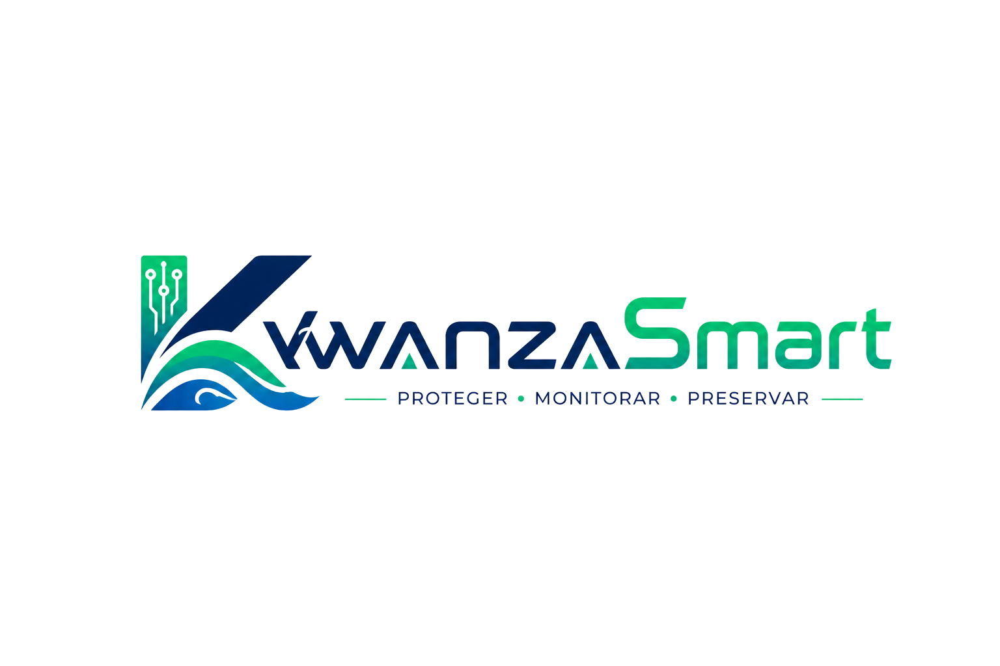
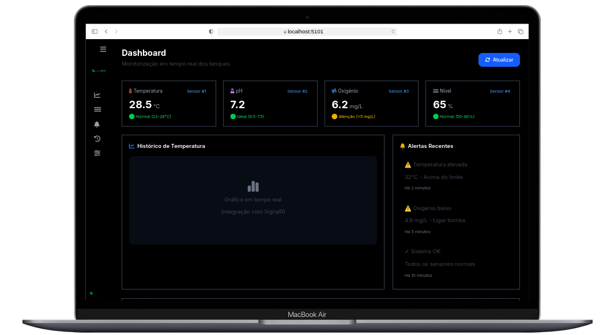

<div align="center">
  

  **Sistema inteligente de monitorização de aquicultura**
  
  [](https://github.com/Adyllsxn/kwanza-smart)
  [](https://adyllsxn.github.io/kwanza-smart/)
  [](./docs/SETUP.md)
  [](LICENSE)
  
  <br/>
  
  > Sensores + backend C# + dashboard em tempo real.  
  > Monitoriza temperatura, pH, oxigénio, nível e turbidez da água.  
  > Alertas automáticos e controlo inteligente para aquicultura.
</div>

---

## **📖 SOBRE O PROJETO**

> O **KwanzaSmart** é um sistema inteligente de monitorização de aquicultura desenvolvido para evitar mortandade de peixes por falta de monitorização. Dados da água em tempo real, alertas automáticos e automatização de tanques para pequenos e médios produtores.

### **🎯 Problemática**

```markdown
⚠️ Produtores perdem peixes por não monitorizar a água em tempo real
⚠️ Falta de alertas automáticos quando parâmetros saem do ideal
⚠️ Soluções existentes são caras ou de difícil manutenção
```

### **💡 Solução**

```markdown
✅ Sensores + PIC enviam dados em tempo real
✅ Dashboard web com gráficos e alertas
✅ Controlo remoto de bombas e alimentadores
```

---

## **🛠️ TECNOLOGIAS**

| Camada | Tecnologias |
|--------|-------------|
| **Backend** | C# .NET 10, ASP.NET Core, Entity Framework Core, PostgreSQL, SignalR, Scalar |
| **Frontend** | Blazor WebAssembly, Blazorise Tailwind, Blazorise Icons FontAwesome |
| **Hardware** | PIC18F4550, ESP8266, DS18B20 (Temperatura), SEN0161 (pH), DO-9542 (Oxigénio), HC-SR04 (Nível) |

---


## **📸 DEMO**
<div align="center">  <br /> <i>Interface principal com gráficos de temperatura, pH e alertas em tempo real</i> </div>

---

## **📄 LICENÇA**

> Este projeto está sob a licença MIT, o que significa que é de código aberto e pode ser utilizado livremente para fins académicos e comerciais, desde que mantidos os créditos.

```markdown
📚 Código aberto (open source)
✅ Livre para uso académico
🤝 Contribuições são bem-vindas
```